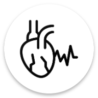

 
	

    
    
<h1 align="center">
	Heart
</h1>

  Your electronic heart health doctor

# :pushpin:What's this

This is my undergraduate graduation project at the School of Artificial Intelligence and Automation of Huazhong University of Science and Technology, guided by Professor [Hu Jing](https://aia.hust.edu.cn/info/1231/5069.htm).

# :bulb:Tech Stack

- Kotlin
- Jetpack Compose
- Room
- Flow
- DataStore
- Bluetooth
- .......

